# Práctica 1: Crear un flujo webhook → API externa → transformación → respuesta JSON

## Objetivo de la práctica:
Al finalizar la práctica, serás capaz de:
- **Construir** un flujo automatizado con webhooks en n8n.
- **Integrar** APIs REST externas y servicios en Python.
- **Transformar** y combinar datos para generar respuestas dinámicas.

## Duración aproximada:
- 90 minutos.

## Credenciales para usar en el registro de N8N:

Consúltalas con tu instructor.

## Instrucciones 

Un banco digital llamado FinanzaPlus desea automatizar la validación de solicitudes de crédito personal en tiempo real. Cuando un cliente envía una solicitud desde la app móvil, se dispara un webhook que recibe los datos (ingresos, historial crediticio, monto solicitado). Esta información debe ser enviada a una API externa de scoring crediticio, luego transformada para estandarizar el formato, enriquecida con un análisis de riesgo usando modelos generativos (desde Azure Foundry o Amazon Bedrock), y finalmente devolver una respuesta en JSON indicando si la solicitud es aprobada, rechazada o requiere revisión manual.

La arquitectura de N8N permite orquestar todo el flujo mediante workflows compuestos por nodos, donde un trigger de tipo webhook inicia el proceso. El manejo de eventos permite reaccionar en tiempo real a nuevas solicitudes de crédito. La integración con APIs REST mediante el nodo HTTP Request facilita consumir servicios externos de scoring. Posteriormente, la transformación de datos (usando nodos de función o servicios en Python) asegura que la información tenga el formato requerido. Finalmente, los modelos generativos aportan una capa inteligente para evaluar el riesgo y enriquecer la respuesta antes de devolverla al cliente en formato JSON.

### Tarea 1. Verificar que las dependencias estén instaladas.
Paso 1. Haz clic en Inicio dentro de tu máquina virtual y ejecuta PowerShell como administrador.

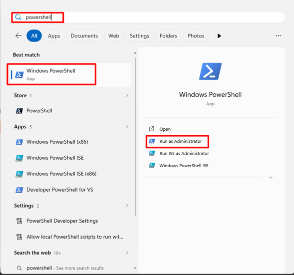

Paso 2.	Ejecuta el siguiente comando para verificar que Docker esté instalado y su versión.
```powershell
docker --version
```
**Resultado esperado:**
Docker version 29.2.0, build abc123

Paso 3. Ejecuta el siguiente comando para verificar que Python esté instalado y su versión.
```powershell
python –version
```

**Resultado esperado:**
Python 3.11.6

Paso 4.	Ejecuta el siguiente comando para verificar que VSC esté instalado y su versión.
```powershell
code --version
```

**Resultado esperado:**
1.87.2 a3f6c6d...

Paso 5.	Crea el directorio del proyecto, en el explorador de archivos abre Documents, haz clic derecho, luego selecciona New Folder y cambia el nombre por: **N8NProject**.

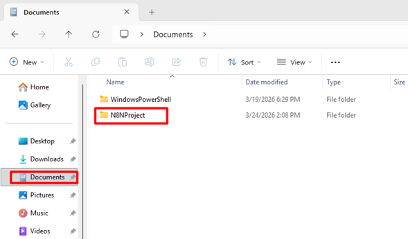
 
---

### Tarea 2.	Levantar la infraestructura con Docker (n8n + PostgreSQL)
Paso 1.	Abrir Visual Studio Code

Paso 2.	Abrir la carpeta creada en la tarea anterior, haciendo clic en File  Open Folder…

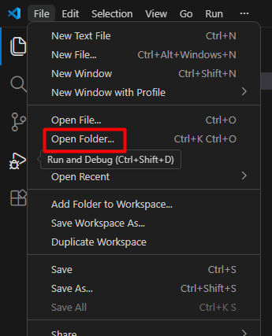
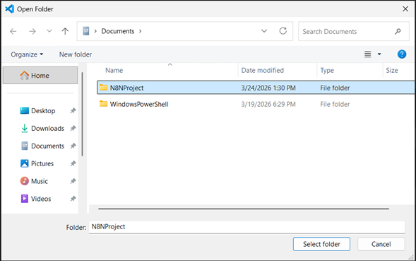
 
Paso 4.	Crea un archivo llamado: ```docker-compose.yml```

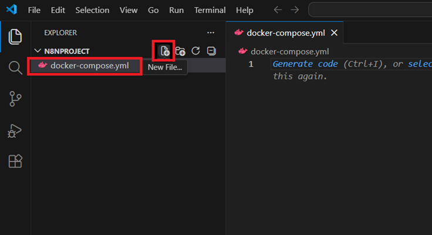
 
Paso 5.	Abre el archivo y agrega la siguiente estructura base:

```yaml
version: "3.8"

services:
  postgres:
    image: postgres:15
    container_name: n8n_postgres
    restart: always
    environment:
      POSTGRES_USER: n8n_user
      POSTGRES_PASSWORD: n8n_pass
      POSTGRES_DB: n8n_db
    ports:
      - "5432:5432"
    volumes:
      - postgres_data:/var/lib/postgresql/data

  n8n:
    image: n8nio/n8n
    container_name: n8n_app
    restart: always
    ports:
      - "5678:5678"
    environment:
      DB_TYPE: postgresdb
      DB_POSTGRESDB_HOST: postgres
      DB_POSTGRESDB_PORT: 5432
      DB_POSTGRESDB_DATABASE: n8n_db
      DB_POSTGRESDB_USER: n8n_user
      DB_POSTGRESDB_PASSWORD: n8n_pass

      N8N_BASIC_AUTH_ACTIVE: "true"
      N8N_BASIC_AUTH_USER: admin
      N8N_BASIC_AUTH_PASSWORD: admin123

      N8N_HOST: localhost
      N8N_PORT: 5678
      WEBHOOK_URL: http://localhost:5678/

    depends_on:
      - postgres

volumes:
  postgres_data:
```
> 📝 Explicación rápida de la configuración
> *	**PostgreSQL** 
>   * Usuario: n8n_user 
>	* Password: n8n_pass 
>   * DB: n8n_db 
>	* Puerto: 5432 
> * **N8N**
>	* Corre en el puerto 5678 
>	* Usa PostgreSQL como base de datos 
>	* Tiene autenticación básica: 
>	    - Usuario: admin 
>	    - Password: admin123


Paso 6.	Abrir una nueva terminal integrada

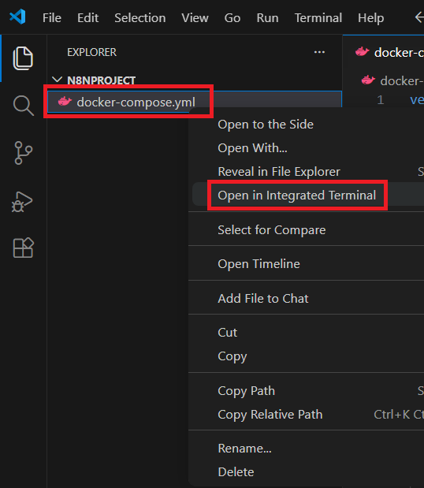

Paso 7.	Levantar los contenedores. Ejecuta el siguiente comando en la terminal. Esto hará:

* Descargar las imágenes si no existen
* Crear los contenedores
* Ejecutarlos en segundo plano

```powershell
docker-compose up -d
```
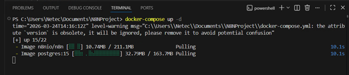
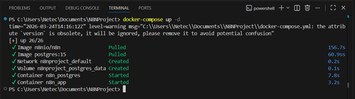

Paso 8.	Verifica que todo esté corriendo, ejecuta este comando:

```powershell
docker ps
```

>📌 **Nota**:
>Deberías ver dos contenedores:
>* n8n_postgres 
>* n8n_app

Paso 9.	Revisa los logs de la implementación. Ejecuta este comando para ver los registros (logs) de los contenedores administrados por Docker Compose en tiempo real.
docker-compose logs -f

Paso 10.	Ejecuta este comando para ver los registros (logs) en tiempo real del contenedor llamado n8n_app
docker logs -f n8n_app

Paso 11.	Acceder a N8N desde el navegador, usando: localhost:5678/setup

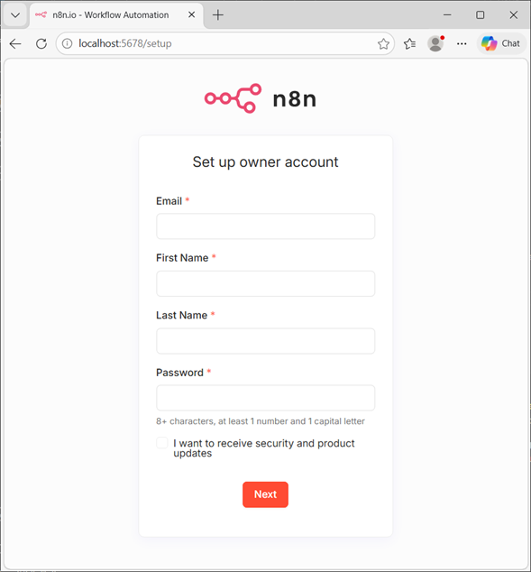
 
Paso 12.	Configura el dueño de la cuenta con el correo proporcionado por el instructor:
- Email: [Correo](#credenciales-para-usar-en-el-registro-de-n8n)
- Contraseña: [N3t3c123*](#credenciales-para-usar-en-el-registro-de-n8n)


Paso 13.	Completa el registro con la información solicitada y haz clic en Get Start. En la sección de la licencia haz clic en Skip.

Paso 14.	Verás la ventana de bienvenida a n8n.

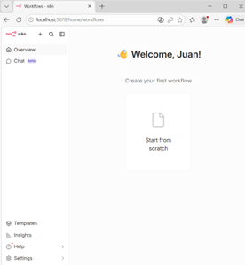

---

### Tarea 3.	Crear workflow con Webhook Trigger en n8n

Paso 1.	En el panel principal haz clic en **New Workflow** (arriba a la izquierda)

 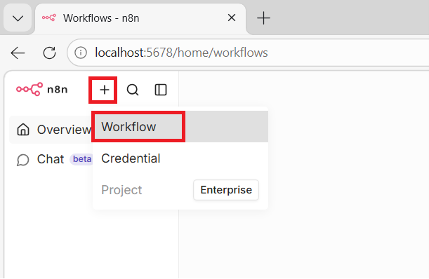


Paso 2.	Verás el lienzo vacío (canvas), donde construirás el flujo. Haz clic en el botón **+** (Add first step).

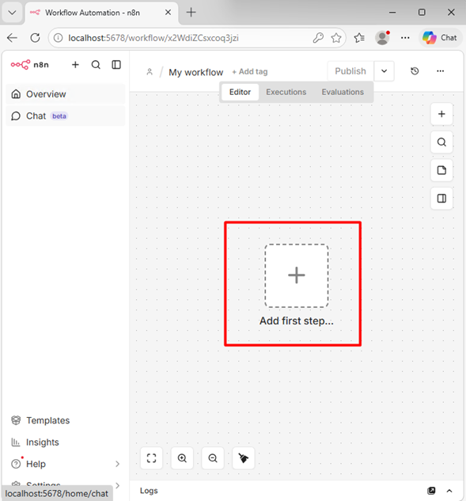

Paso 3.	En el buscador escribe: ```Webhook```. Selecciona el nodo Webhook

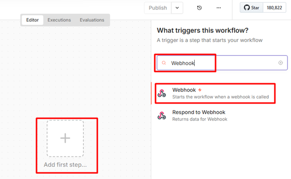
 

Paso 4.	Configura el Webhook. Inicialmente, cambia el método de GET a POST.

Paso 5.	En el campo Path reemplaza el contenido por defecto a: ```credit-request```

Paso 6.	Verifica la URL de prueba generada, será algo como:
**http://localhost:5678/webhook-test/credit-request**

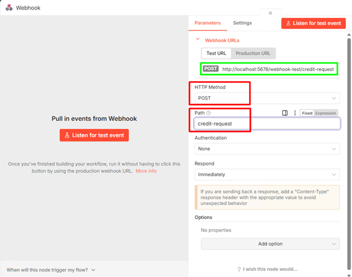

Paso 7.	Hax clic en la “X” para regresar al lienzo.

Paso 8.	Haz clic en los tres puntos horizontales del costado superior y selecciona **Rename**. Cambia el nombre por: ```Credit Scoring Flow```

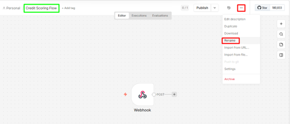
 
Paso 9.	Activa modo prueba (escucha del webhook), haciendo clic en el botón: **Execute workflow**

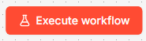

Paso 10.	En el escritorio de tu máquina virtual busca y ejecuta **Postman**. 


Paso 11.	Cierra la ventana de inicio de sesión en Postman. En postman envía el POST de prueba.

> 🎯**DESAFÍO:** La prueba también puedes enviarla usando el comando curl. Con base en el siguiente comando ejecuta la prueba desde Postman y envía un pantallazo al chat de la clase con el resultado correcto de Postman y de n8n.

> 💡**PISTA:** Puedes echar un vistazo al paso 8 de la siguiente tarea para guiarte en el proceso.

```powershell
curl -X POST http://localhost:5678/webhook-test/credit-request \
-H "Content-Type: application/json" \
-d '{
  "name": "Juan Perez",
  "income": 3000,
  "credit_amount": 10000
}'
```
**Resultado esperado en Postman:**

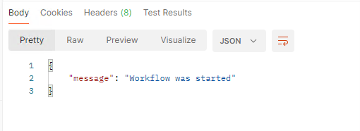 

**Resultado esperado en N8N:**

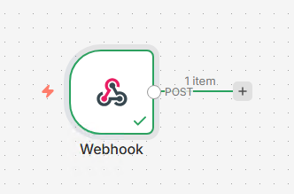
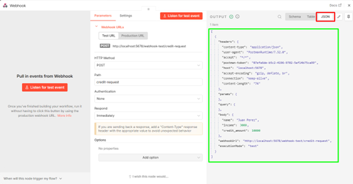
 

> 📌**Nota:**
>* /webhook-test/... → solo funciona en modo prueba
>* /webhook/... → funciona cuando el workflow está activo (producción)

---

### Tarea 4.	Recepción y validación de datos (con Python)

Paso 1.	Regresa a VSC y crea un nuevo directorio dentro de /N8NProject, llamado /python-service

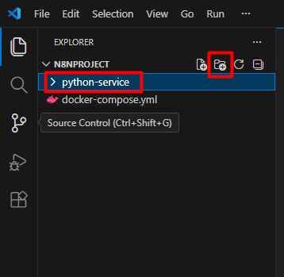

Paso 2.	Dentro de este directorio crea dos archivos:
* ```app.py```
* ```requirements.txt```

Paso 3.	Abre el archivo **requirements.txt** y copia el siguiente contenido:
```
fastapi
uvicorn
```
Paso 4.	Guarda el archivo requirements.txt. Ahora abre app.py y copia el siguiente contenido:

```python
from fastapi import FastAPI
from pydantic import BaseModel, Field
from typing import Optional

app = FastAPI()


# Modelo de entrada (estructura esperada)
class CreditRequest(BaseModel):
    customer_id: str
    name: Optional[str] = None
    income: float = Field(..., gt=0)
    credit_amount: float = Field(..., gt=0)
    credit_history: Optional[str] = None


# Endpoint de validación
@app.post("/validate")
def validate_request(data: CreditRequest):
    errors = []

    # Validaciones adicionales (reglas de negocio simples)
    if data.income < 100:
        errors.append("Income too low for credit evaluation")

    if data.credit_amount > data.income * 10:
        errors.append("Credit amount too high relative to income")

    # Si hay errores
    if errors:
        return {
            "valid": False,
            "errors": errors
        }

    # Si todo está bien
    return {
        "valid": True,
        "data": {
            "customer_id": data.customer_id,
            "income": data.income,
            "credit_amount": data.credit_amount,
            "credit_history": data.credit_history
        }
    }
```

Paso 5.	Guarda el archivo app.py. En la terminal instala las dependencias ejecutando este comando:

```powershell
cd ./python-service
pip install -r requirements.txt
```

Paso 6.	Levanta el servidor ejecutando el siguiente comando:
```powershell
uvicorn app:app --reload --port 8000
```

**Resultado esperado:**

Uvicorn running on http://127.0.0.1:8000


Paso 7.	💡¿Cuál de los siguientes scripts será validado correctamente? ¿Por qué?

>**A.** curl -X POST http://localhost:8000/validate \
-H "Content-Type: application/json" \
-d '{
  "customer_id": "CUST-001",
  "name": "Juan Perez",
  "income": 3000,
  "credit_amount": 10000,
  "credit_history": "good"
}'

>**B.**	curl -X POST http://localhost:8000/validate \
-H "Content-Type: application/json" \
-d '{
  "customer_id": "CUST-001",
  "income": 50,
  "credit_amount": 10000
}'

Paso 8.	Pongamos a prueba cada solicitud desde Postman. Abre Postman, si no está abierto aún, en una nueva pestaña configura lo siguiente:
* Selecciona el método POST
* Agrega el endpoint http://localhost:8000/validate
* En la pestaña Headers configura:
    * Key: Content-Type
    * Value: application/json
* En la pestaña Body selecciona raw y agrega el payload de cada una de las opciones del paso anterior, una a la vez.

>**A.**
```json
{
  "customer_id": "CUST-001",
  "name": "Juan Perez",
  "income": 3000,
  "credit_amount": 10000,
  "credit_history": "good"
}
```
>**B.**
```json
{
  "customer_id": "CUST-001",
  "income": 50,
  "credit_amount": 10000
}
```

Paso 9.	Abre nuevamente la ventana del navegador con tu workflow de n8n, allí verás el Webhook que configuraste en la tarea anterior. A la derecha del nodo, haz clic en el **+** y luego busca y selecciona ```HTTP Request```.

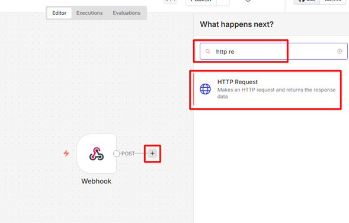
 

Paso 10.	Configura el nodo de la siguiente manera:
* **Método:** POST
* **URL:** ```http://host.docker.internal:8000/validate```
* **Send Body:** ON
* **Body Content Type:** JSON
* **Specify Body:** Using JSON
* **JSON:** ```{{$json}}``` 💡**Nota:** Esto significa: “envía exactamente lo que llegó al webhook”

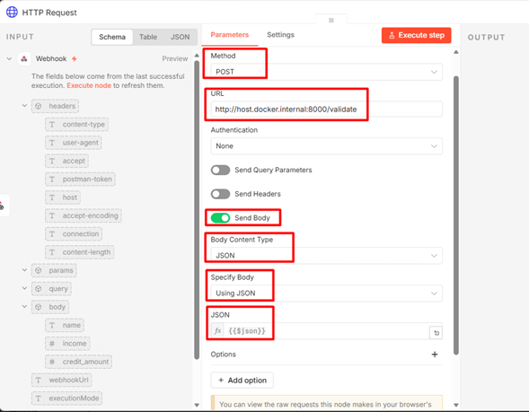

Paso 11.	Cierra la ventana del nodo para regresar al canvas, y haz clic en Execute workflow para poner el flujo en modo de escucha. 

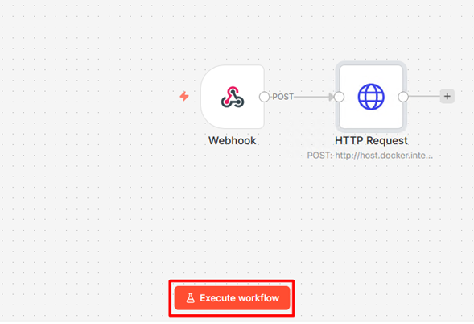

Paso 12.	Regresa a Postman y configura la siguiente solicitud:
* POST
* http://localhost:5678/webhook-test/credit-request
* En la pestaña Headers configura:
    * Key: Content-Type
    * Value: application/json
* En la pestaña Body selecciona raw y agrega lo siguiente:
```json
{
  "customer_id": "CUST-001",
  "income": 50,
  "credit_amount": 10000
}
```
Paso 13.	Debes recibir una respuesta en Postman como la siguiente:
```
{
    "message": "Workflow was started"
}
```

Paso 14.	Regresa a n8n, y verifica la ejecución. **Sale un error**, no te preocupes, es intencional. Revisa el mensaje de error.

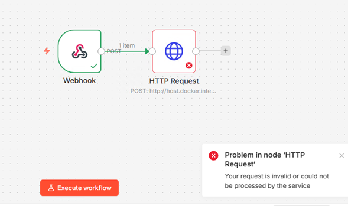
 

Paso 15.	El nodo está recibiendo como parámetro del Body: 

>❌{"headers": {...},"params": {},"query": {},"body": {"customer_id": "CUST-001","income": 50,"credit_amount": 10000},...}. Pero sólo requiere la sección del Body, este error es muy común y se identifica con el código http: 422.

Paso 16.	Haz clic sobre el parámetro que configuraste previamente: <span style="color:green">{{$json}}</span> que está en color verde, y valida todo lo que se está pasando al Body.

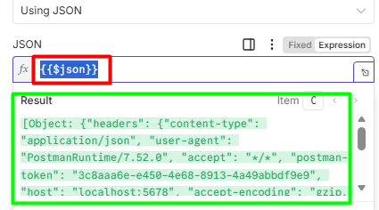

Paso 17.	Reemplaza ese parámetro por: ```{{$json["body"]}}```

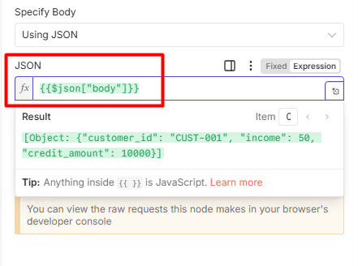 

Paso 18.	Cierra la ventana del nodo, ejecuta el flujo y lanza nuevamente la solicitud desde Postman. 

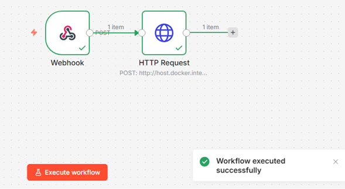


Paso 19.	Ahora ya se habrá ejecutado correctamente todo el flujo, abre nuevamente el nodo y verifica si fue o no validado. 

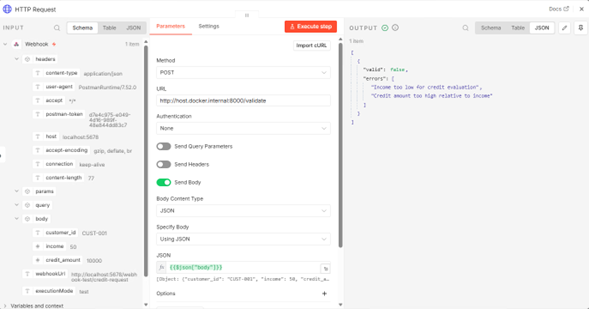
 

> 🎯**DESAFÍO:** Envía un cuerpo que sea válido para que el resultado del nodo HTTP Request sea: "valid": true.

Paso 20.	Cierra la ventana del nodo y regresa al lienzo del flujo. Al costado derecho del nodo HTTP Request haz clic en el **+**, busca ```condition``` y selecciona **If**.

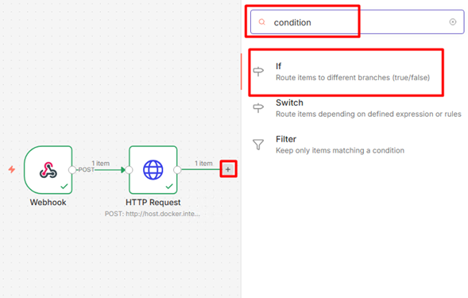

Paso 21.	Configura el nodo If de la siguiente manera:
* **Value 1:** ```{{$json["valid"]}}```
* **Operation:** Is true

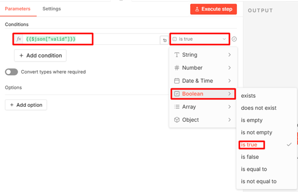

 
Paso 22.	Cierra la ventana del nodo If. De regreso al lienzo en n8n al lado derecho de la opción false, haz clic en **+** y busca ```Respond to Webhook``` y selecciona **Respond to Webhook**. 

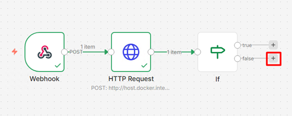
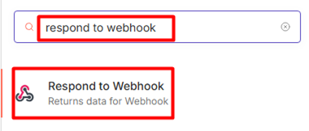

Paso 23.	Configura el nodo Respond to Webhook (False) de la siguiente manera:
* **Respond With:** JSON
* **Response Body:** 
```json
{
  "status": "error",
  "message": "Invalid input",
  "details": "errors"
}
```
* **Add Option:** Response Code: 400

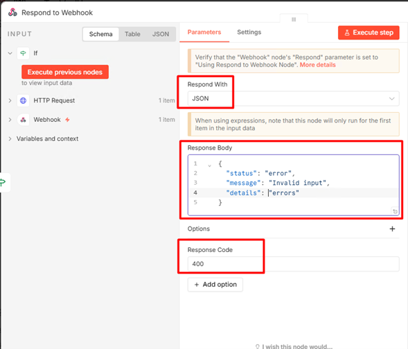

Paso 24.	Cierra la ventana del nodo Respondt o Webhook (false), regresa al lienzo y ahora haz clic en **+** del lado derecho de la opción true. Busca ```Respond to Webhook``` y selecciona **Respond to Webhook**.

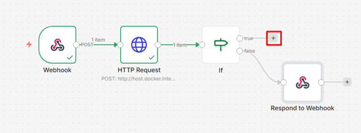


 
 

Paso 25.	Configura el nodo Respond to Webhook (True) de la siguiente manera:
* **Respond With:** JSON
* **Response Body:** 
```json
{
  "status": "success",
  "message": "Validation passed",
  "data": "data"
}
```
* **Add Option:** Response Code: 200

Paso 26.	Cierra la ventana del nodo Respond to Webhook, y ejecuta el flujo que debe tener un aspecto similar a este:

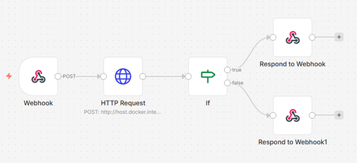
 

4.27	Abre Postman con el flujo de n8n en modo escucha y lanza una nueva solicitud. ❌ El nodo falla. No te preocupes, es de esperarse.

📝En tu nodo Webhook tienes configurado **Respond: Immediately**, esto significa que el propio nodo Webhook envía la respuesta en cuanto recibe la petición, sin esperar al resto del flujo. Sin embargo, en tu flujo tienes nodos **Respond to Webhook** conectados después de condiciones. Cuando el Webhook está en modo Immediately, esos nodos nunca se usan, y n8n lanza el error: **Unused Respond to Webhook node found in the workflow**.

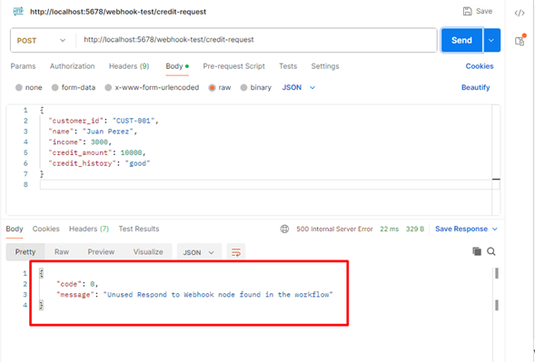
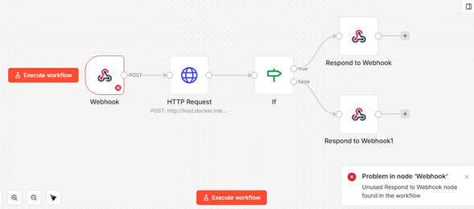

Paso 28.	Si quieres responder con los nodos “Respond to Webhook”, cambia la configuración del Webhook a:
* **Respond:** Using ‘Respond to Webhook’ Node

Así, el Webhook esperará a que tu flujo llegue a uno de los nodos Respond to Webhook, y la respuesta se enviará desde allí.

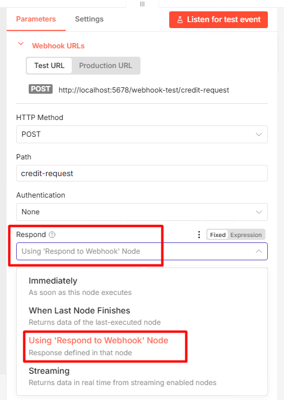

Paso 29.	Cierra la ventana del nodo, ejecuta tu flujo de n8n en modo escucha y ejecuta las pruebas nuevamente desde Postman. Ahora en Postman recibes el mensaje y tu flujo se ejecuta de acuerdo a al parámetro enviado. 
 
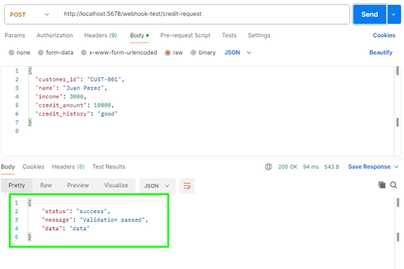
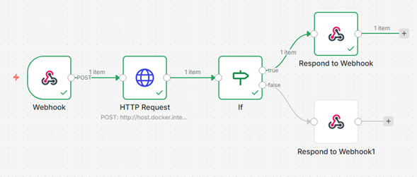
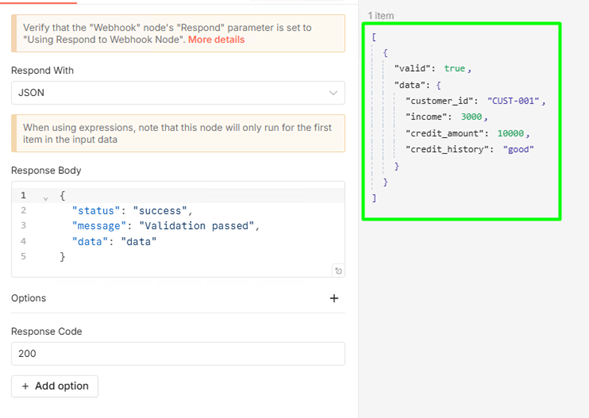
 
---
### Tarea 5.	Transformación de datos en n8n
Paso 1.	Elimina la conexión directa al Respond (True). Haz clic sobre este nodo y luego en el ícono de eliminar. 

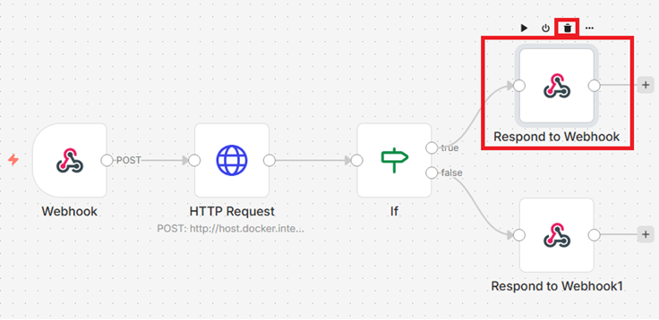

Paso 2.	Haz clic en el **+** al costado derecho de true, busca la opción ```set``` y selecciona **Edit Fields (Set)**.

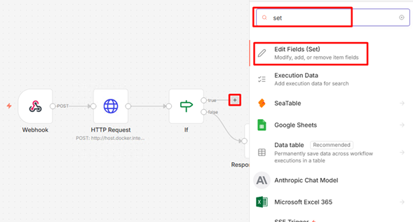

Paso 3.	Haz clic en la opción **Add Field** del costado central. 

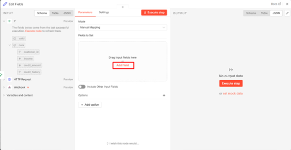
 
Paso 4.	Configura los siguientes valores:
* **Name:** ```score```
* **Value:** ```{{$json["score"]}}```

Paso 5.	Haz clic en Add Field en el costado inferior del campo que acabas de agregar, y configura los siguientes valores:

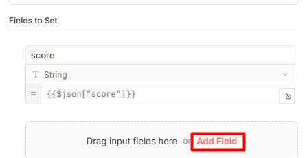

* Name: ```risk_level```
* Value: 
```
{{ 
  $json["score"] >= 700 ? "low" :
  $json["score"] >= 600 ? "medium" :
  "high"
}}
```
Paso 6.	Repite los pasos anteriores agregando los siguientes valores:

---
* **Name:** ```decision```
* **Value:** 
```
{{
  $json["score"] >= 700 ? "approved" :
  $json["score"] >= 600 ? "review" :
  "rejected"
}}
```
---
* **Name:** ```timestamp```
* **Value:** ```{{ new Date().toISOString() }}```
---

> 🎯**DESAFÍO:**  Prueba el flujo y verifica el valor del score. ¿Cuál es el valor del score? ¿Por qué sale ese valor para el score?


> 💡**PISTA:**
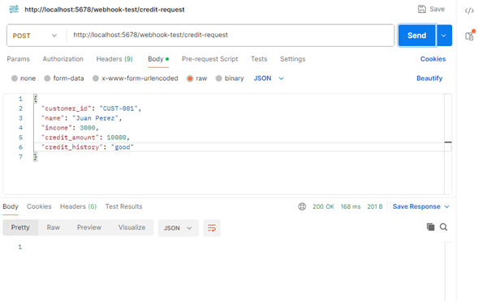
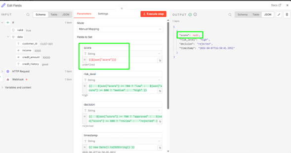

Punto 9.	Vamos a corregir esto. Como te pudiste dar cuenta, el flujo sólo valida pero no calcula el score, debemos hacer algunos pasos adicionales para que funcione.

Primero, vamos a agregar un nuevo nodo HTTP Request en la conexión que está entre **If(True)** y **Set**. 

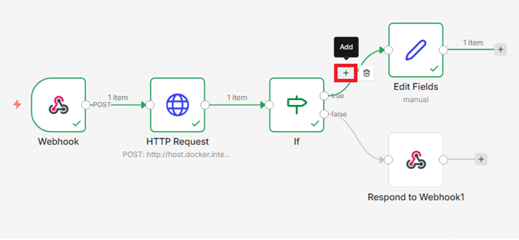
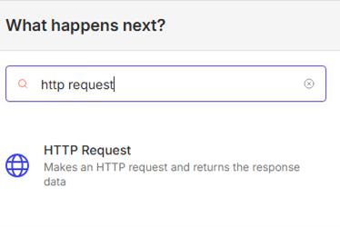

 
Paso 10.	Configura el nodo de la siguiente manera:
* **Method:** POST
* **URL:** http://host.docker.internal:8000/score
* **Send Body:** On
* **Body Content Type:** JSON
* **Specify Body:** Using JSON
* JSON: 
```
{
  "income": {{$json["data"]["income"]}},
  "credit_amount": {{$json["data"]["credit_amount"]}}
}
``` 
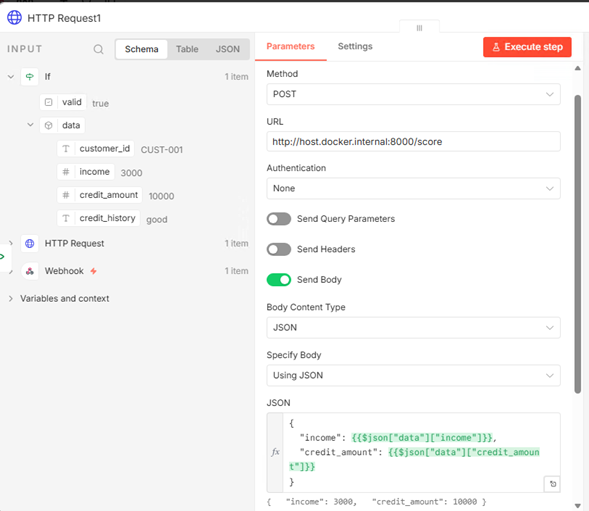

Paso 11.	Ahora vamos a usar un Merge para combinar las dos salidas en una y pueda ser usada por el set. Haz clic en el **+** de la conexión entre el nuevo **HTTP Request** del score y el **Set**.


Paso 12.	Busca ```Merge``` y configúralo de la siguiente manera:
* **Mode:** Combine.
* **Combine By:** Position
* **Number of Inputs:** 2


Paso 13.	Regresa al canvas. Crea otra conexión desde If(true) al Input 2 del Merge. Ahora sí quedaría tu flujo.


Paso 14.	Hay un último detalle. Si revisas el script de Python que creamos anteriormente, aún no tiene endpoint para la ejecución de una validación del Score. Regresa a VSC y en el archivo **app.py** modifica agrega el siguiente fragmento justo antes del de validación.

```python
# Endpoint de puntuación
@app.post("/score")
def get_score(data: dict):
    income = data.get("income", 0)
    credit_amount = data.get("credit_amount", 0)

    if income == 0:
        score = 300
    else:
        ratio = credit_amount / income

        if ratio < 2:
            score = 750
        elif ratio < 5:
            score = 650
        else:
            score = 500

    return {
        "score": score
    }
```

Paso 15.	Guarda el script con Ctrl+S y fíjate que la consola te indica que detectó los cambios y los aplicó.


 
Paso 16.	Valida nuevamente usando Postman, y revisa que ahora tengas también el score.

---

### Resultado esperado


> 🎯**DESAFÍO OPCIONAL:** Construye un nodo en n8n para que el resultado se visualice en Postman. 


