# Práctica 2: Flujo automatizado: formulario → análisis con modelo LLM (Bedrock o Foundry) → almacenamiento en base de datos local

## Objetivo de la práctica:
Al finalizar la práctica, serás capaz de:
- **Diseñar** una interfaz web que permita capturar información y enviarla a un flujo de trabajo automatizado en N8N.
- **Integrar** modelos generativos creados en Azure Foundry y Amazon Bedrock al flujo de N8N para enriquecer la información capturada.
- **Almacenar** los resultados procesados del flujo de N8N en una base de datos local para su consulta posterior.

## Prerrequisitos

- Haber completado el Laboratorio 1.
- Tener el workflow Credit Scoring Flow activo o listo para pruebas.

## Objetivo Visual 

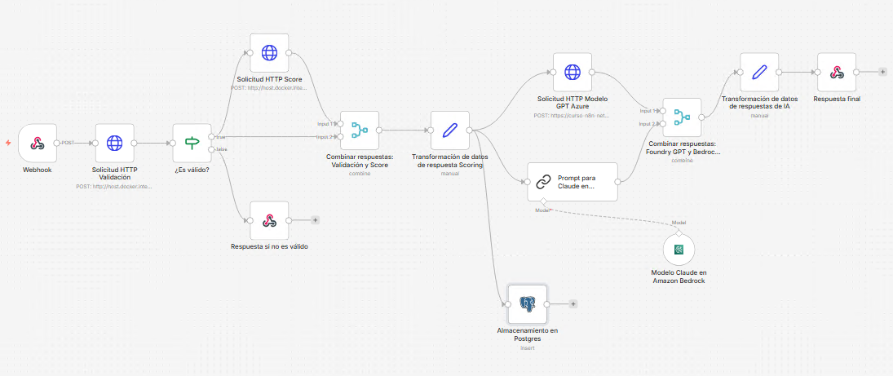

## Duración aproximada:
- 90 minutos.

## Credenciales para usar en Azure y AWS:

Consúltalas con tu instructor.

## Instrucciones 

Un banco digital llamado FinanzaPlus desea automatizar la validación de solicitudes de crédito personal en tiempo real. Cuando un cliente envía una solicitud desde la app móvil, se dispara un webhook que recibe los datos (ingresos, historial crediticio, monto solicitado). Esta información debe ser enviada a una API externa de scoring crediticio, luego transformada para estandarizar el formato, enriquecida con un análisis de riesgo usando modelos generativos (desde Azure Foundry o Amazon Bedrock), y finalmente devolver una respuesta en JSON indicando si la solicitud es aprobada, rechazada o requiere revisión manual.

La arquitectura de N8N permite orquestar todo el flujo mediante workflows compuestos por nodos, donde un trigger de tipo webhook inicia el proceso. El manejo de eventos permite reaccionar en tiempo real a nuevas solicitudes de crédito. La integración con APIs REST mediante el nodo HTTP Request facilita consumir servicios externos de scoring. Posteriormente, la transformación de datos (usando nodos de función o servicios en Python) asegura que la información tenga el formato requerido. Finalmente, los modelos generativos aportan una capa inteligente para evaluar el riesgo y enriquecer la respuesta antes de devolverla al cliente en formato JSON.

### Tarea 1. Levantar y probar las dependencias necesarias hechas en el laboratorio 1.
Paso 1. Accede a VSC en tu máquina local. De ser necesario abre el folder del proyecto que estamos trabajando. Haz clic derecho en **python-service** en el árbol de navegación del lado izquierdo, y selecciona: **Open in a integrated Terminal**.

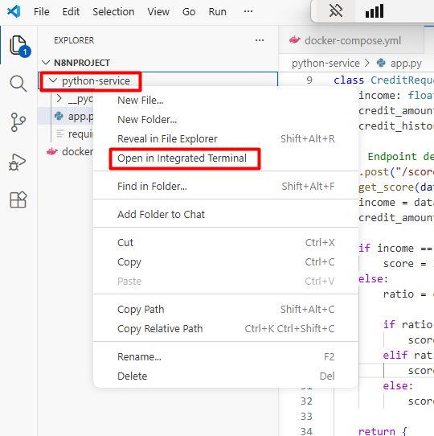

Paso 2.	Ejecuta el siguiente comando para verificar si están corriendo en segundo plano todos los servicios definidos en un archivo docker-compose.yml, y si no, levantarlos y ejecutarlos.
.
```powershell
docker-compose up -d
```
**Resultado esperado:**

>[+] up 2/2
>
>✔ Container n8n_postgres Running                                             
>✔ Container n8n_app      Running  

Paso 3. Ejecuta el siguiente comando para levantar el servidor de validación creado en el lab 1.
```powershell
uvicorn app:app --reload --port 8000
```

**Resultado esperado:**
>- **INFO:**     Uvicorn running on http://127.0.0.1:8000 (Press CTRL+C to quit)
>- **INFO:**     Started reloader process [9648] using StatReload
>- **INFO:**     Started server process [960]
>- **INFO:**     Waiting for application startup
>- **INFO:**     Application startup complete.

Paso 4.	Verifica el funcionamiento del flujo. 2.11	Accede a N8N desde el navegador, usando: ```localhost:5678/setup```. Abre el flujo **Credit scoring flow** creado anteriormente. 

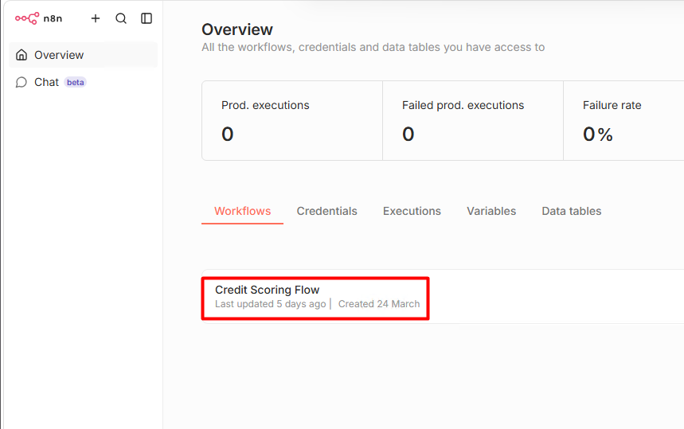

Paso 5.	Ejecuta el flujo haciendo clic en el botón o presiona **Ctrl+Enter**. Abre Postman, cierra la ventana de bienvenida que te pide iniciar sesión y configura la siguiente solicitud en Postman:

* **Method:** Post.
* **URL:** ```http://localhost:5678/webhook-test/credit-request```
* **Headers:**
    * Key: Content-Type
    * Value: application/json
* **Body:**
```json
{
  "customer_id": "CUST-001",
  "name": "Juan Perez",
  "income": 3000,
  "credit_amount": 10000,
  "credit_history": "good"
}
```

Paso 6. Lanza la solicitud desde Postman y verifica el resultado en n8n.


 
---

### Tarea 2.	Crear la interfaz gráfica del formulario con html y flask
Paso 1.	En Visual Studio Code, dentro de N8NProject, crea una carpeta llamada ```lab2-flask-app``` con esta estructura:

```plaintext
lab2-flask-app/
├── app.py
├── requirements.txt
├── templates/
│   └── index.html
└── static/
    └── styles.css
```

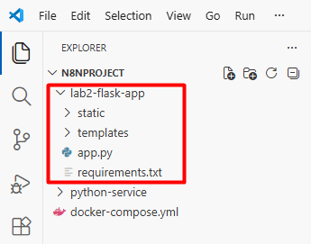

Paso 2. En el archivo requirements.txt agrega: 

```text
flask
requests
python-dotenv
psycopg2-binary
```

Paso 3. En el archivo **templates/index.html** crea  formulario, pegando lo siguiente: 

```html
<!doctype html>
<html lang="es">
<head>
  <meta charset="utf-8">
  <meta name="viewport" content="width=device-width, initial-scale=1">
  <title>Solicitud de Crédito - FinanzaPlus</title>
</head>
<body>
  <h1>Solicitud de Crédito</h1>
  <form method="POST" action="/submit">
    <label>Nombre</label>
    <input type="text" name="name" required>

    <label>Documento</label>
    <input type="text" name="customer_id" required>

    <label>Ingreso mensual</label>
    <input type="number" name="income" step="0.01" required>

    <label>Monto solicitado</label>
    <input type="number" name="credit_amount" step="0.01" required>

    <label>Historial crediticio</label>
    <select name="credit_history">
      <option value="excellent">Excelente</option>
      <option value="good">Bueno</option>
      <option value="fair">Regular</option>
      <option value="bad">Malo</option>
    </select>

    <button type="submit">Enviar solicitud</button>
  </form>
</body>
</html>
```

Paso 4. En el archivo **app.py** agrega el siguiente código para crear la aplicación Flask que renderiza el formulario y maneja su envío:

```python
from flask import Flask, render_template, request
import requests

app = Flask(__name__)

N8N_WEBHOOK_URL = "http://localhost:5678/webhook-test/credit-request"


# Ruta principal (formulario)
@app.route("/")
def index():
    return render_template("index.html")


# Ruta que procesa el formulario
@app.route("/submit", methods=["POST"])
def submit():
    try:
        # 1. Capturar datos del formulario
        payload = {
            "customer_id": request.form.get("customer_id"),
            "name": request.form.get("name"),
            "income": float(request.form.get("income", 0)),
            "credit_amount": float(request.form.get("credit_amount", 0)),
            "credit_history": request.form.get("credit_history")
        }

        print("📤 Enviando a n8n:", payload)

        # 2. Enviar a n8n
        response = requests.post(N8N_WEBHOOK_URL, json=payload)

        # 3. Intentar convertir respuesta a JSON
        try:
            raw_result = response.json()
            
            # Si n8n devuelve una lista [{}], tomamos el primer elemento
            if isinstance(raw_result, list) and len(raw_result) > 0:
                result = raw_result[0]
            else:
                result = raw_result
        except:
            return f"""
            <h2>Error</h2>
            <p>No se recibió JSON válido desde n8n</p>
            <pre>{response.text}</pre>
            <br><br>
            <a href="/" style="padding:10px; background:#007BFF; color:white; text-decoration:none;">Volver</a>
            """

        print("📥 Respuesta de n8n:", result)

        # 4. Mostrar resultado en HTML
        return f"""
        <html>
        <head>
            <title>Resultado del crédito</title>
        </head>
        <body style="font-family: Arial; text-align: center; margin-top: 50px;">
            
            <h2>Resultado del crédito</h2>
            
            <p><b>Score:</b> {result.get('score')}</p>
            <p><b>Riesgo:</b> {result.get('risk_level')}</p>
            <p><b>Decisión:</b> {result.get('decision')}</p>

            <br><br>

            <a href="/" style="
                padding: 12px 20px;
                background-color: #28a745;
                color: white;
                text-decoration: none;
                border-radius: 5px;
                font-weight: bold;
            ">
                Nueva solicitud
            </a>

        </body>
        </html>
        """

    except Exception as e:
        return f"""
        <h2>Error inesperado</h2>
        <p>{str(e)}</p>
        <br><br>
        <a href="/" style="padding:10px; background:#007BFF; color:white; text-decoration:none;">Volver</a>
        """


# 🔹 Ejecutar app
if __name__ == "__main__":
    app.run(debug=True, port=5000)
```

Paso 5. Haz clic derecho en el directorio **lab2-flask-app** y abre una nueva terminal integrada.

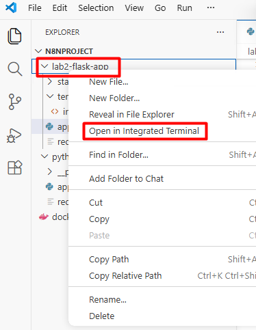

Paso 6. Ejecuta el siguiente comando para instalar las dependencias:

```powershell

pip install -r requirements.txt
```

---

### Tarea 3. Prueba el funcionamiento del formulario con N8N

Paso 1. En la misma terminal que instalaste las dependencias en el último paso de la tarea anterior, ejecuta el siguiente comando para lenvantar la app flask:

```powershell
python app.py
```
**Resultado esperado:**
```text
* Running on http://
* Running on all addresses (0.0.0.0)
* Running on http://127.0.0.1:5000
* Running on http://10.0.0.5:5000
Press CTRL+C to quit
* Restarting with stat
* Debugger is active!
```

Paso 2. Regresa a la ventana del navegador den n8n y después del nodo **Set** agrega un nuevo nodo ```Respond to Webhook```.


Paso 3. Configura el nodo ```Respond to Webhook``` de la siguiente manera:

* **Respond With:** JSON
* **Response Body:** 
Antes de escribir lo siguiente, elige la opción Expression en el cuadro de texto.
```json
{
  "status": "success",
  "customer_id": "{{ $json.customer_id }}",
  "score": "{{ $json.score }}",
  "risk_level": "{{ $json.risk_level }}",
  "decision": "{{ $json.decision }}"
}
```
* **Add Option:** Response Code: 200

Paso 5. Ejecuta el flujo.

Paso 6. Abre el navegador y accede a ```http://localhost:5000```. Deberías ver el formulario de solicitud de crédito.

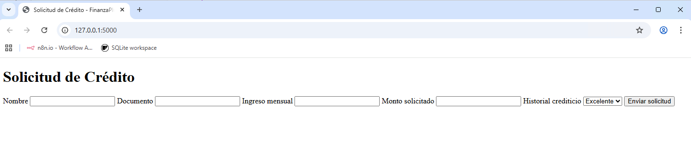

Paso 7. Completa el formulario con datos de prueba y envíalo.
**Resultado esperado:**
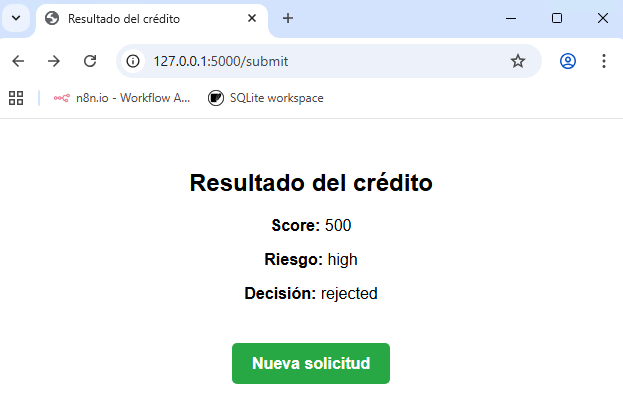

---

### Tarea 4. Guardar datos en PostgreSQL desde n8n

Paso 1. Haz clic en **Inicio** dentro de tu máquina virtual, busca y abre ```powershell```. Ejecuta el siguiente comando para verificar que PostgreSQL esté corriendo.

```powershell
docker ps
```
**Resultado esperado:**
>xxxxxnnnn555   postgres:15   "docker-entrypoint.s…"   x weeks ago   Up x hours   0.0.0.0:5432->5432/tcp, [::]:5432->5432/tcp   n8n_postgres

Paso 2. Entra al contenidor donde se está ejecutando la base de datos, ejecutando este comando: 

```powershell
docker exec -it n8n_postgres psql -U n8n_user -d n8n_db
```

**Resultado esperado:**
```text
psql (15.17 (Debian 15.17-1.pgdg13+1))
Type "help" for help.

n8n_db=#
```

Paso 3. Crea una tabla llamada credit_applications con la siguiente estructura:

```sql
CREATE TABLE credit_applications (
  id SERIAL PRIMARY KEY,
  score INT,
  risk_level VARCHAR(20),
  decision VARCHAR(20),
  timestamp TIMESTAMP
);
```

Paso 4. Verifica que la tabla se haya creado correctamente con el siguiente comando:

```sql
\d credit_applications
```

**Resultado esperado:**

| Column | Type | Collation | Nullable | Default

Indexes:
    "credit_applications_pkey" PRIMARY KEY, btree (id)

Paso 5. Reresa a la ventana de n8n en el navegador, y después del nodo **Set** agrega un nodo, busca ```Postgres``` y luego selecciona ```Insert rows in a table```.

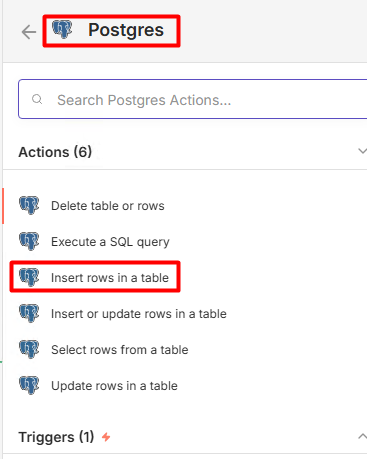

Paso 6. En la ventana de configuración del nodo **Postgres**, selecciona el botón: **Set up credential**, y configura los siguientes valores:

* **Host:** ```postgres```
* **Database:** ```n8n_db```
* **User:** ```n8n_user```
* **Password:** ```n8n_pass```
* **Port:** ```5432```

Los demás campos déjalos por defecto. Haz clic en el botón **Save** del costado inferior. Verás un mensaje de confirmación de conexión exitosa. Cierra la ventana de configuración de credenciales para regresar a la configuración del nodo.

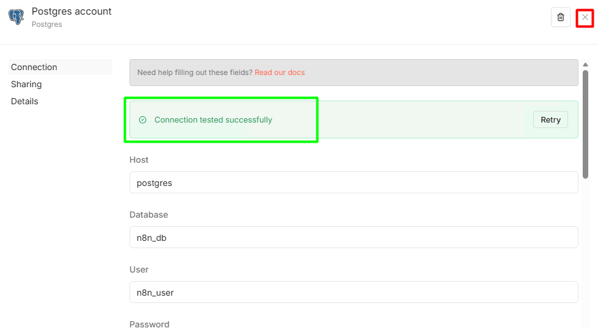

Paso 7. De regreso a la configuración del nodo, en la sección **Table**, por defecto de estar la opción **From List** (de no ser así seleccionala), busca y selecciona la tabla que creamos previamente: ```credit_applications```.

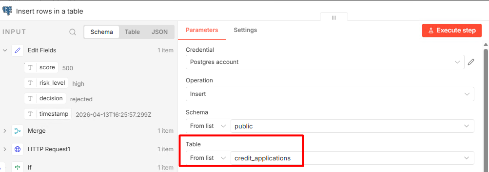

Paso 8. Ahora en **Mapping Column Mode** asegúrate que esté seleccionada la opción ```Map Each Column Manually```. En la parte inferior debes ver los valores a mapear, configuralos de la siguiente manera:

* **id:** Haz clic sobre el campo, luego en los tres puntos verticales junto a **Fixed|Expression** y selecciona la opción **Reset Value**.

* **score**
```javascript
{{$json["score"]}}
```
* **risk_level**
```javascript
{{$json["risk_level"]}}
```
* **decision**
```javascript
{{$json["decision"]}}
```
* **decision** Elige expression
```javascript
{{$json["timestamp"]}}
```

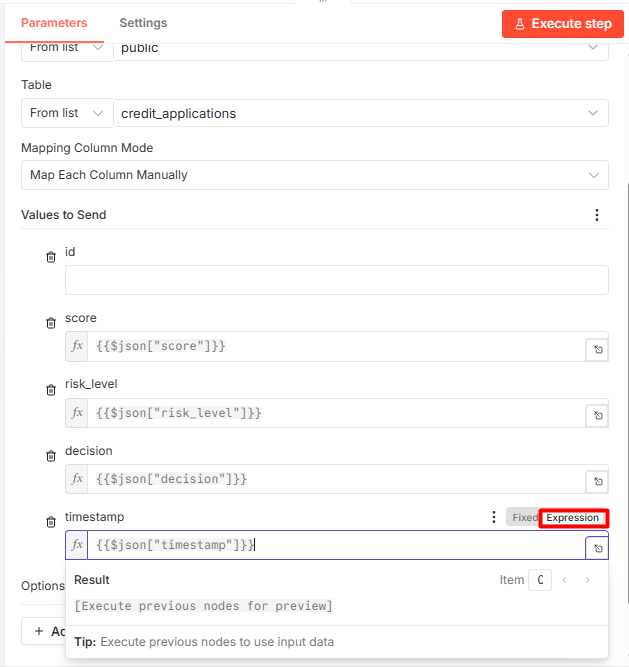

Paso 9. Ejecuta el flujo en n8n, regresa a la ventana de la aplicación flask diligencia el formulario con estos datos:
* Nombre: "Tu nombre"
* Documento: ```123456```
* Ingreso mensual: ```2000```
* Monto solicitado: ```2000```
* Historial crediticio: **Excelente**

Paso 10. Debiste recibir este mensaje en la aplicación:

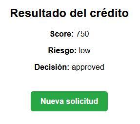

Paso 11. Para verificar que los datos se hayan guardado en la base de datos, regresa a la terminal de powershell donde accediste a PostgreSQL y ejecuta el siguiente comando:

```sql
SELECT * FROM credit_applications;
```

**Resultado esperado:**
| id | score | risk_level | decision | timestamp |
|----|-------|------------|----------|---------------------|
| 1  | 750   | low        | approved | 2024-06-01 12:00:00 |

### Tarea 5. Crear los deployments para consumir los modelos generativos en Azure y AWS

Paso 1. En el navegador de tu máquina virtual ingresa a ```https://ai.azure.com/```.

Paso 2. Haz clic en iniciar sesión e ingresa con las [credenciales](#credenciales-para-usar-en-el-registro-de-n8n) compartidas por el instructor.

Paso 3. Baja a la sección de los modelos, busca y escoge ```gpt-4o```:

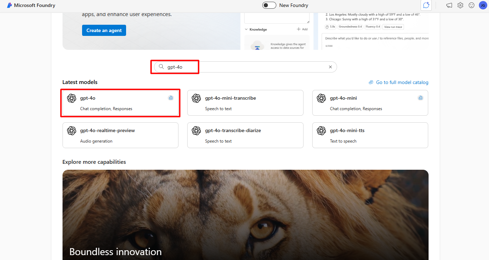

Paso 4. Haz clic en el botón **Use this model** y en la lista desplegable Select or search by name elige la opción: **+ Create a new project**. El nombre del proyecto será ```Curso_N8N-Netec```. FInalmente haz clic en el botón **Create and continue**.

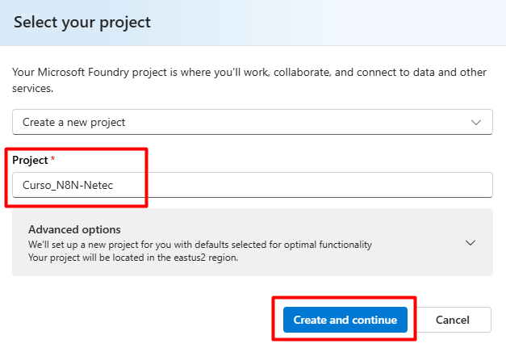

Espera unos momentos hasta la creación de tu proyecto.

Paso 5. En la siguiente pantalla, haz clic en el botón **Deploy** para crear el deployment del modelo.

Paso 6. Conserva la ventana actual del navegador. 

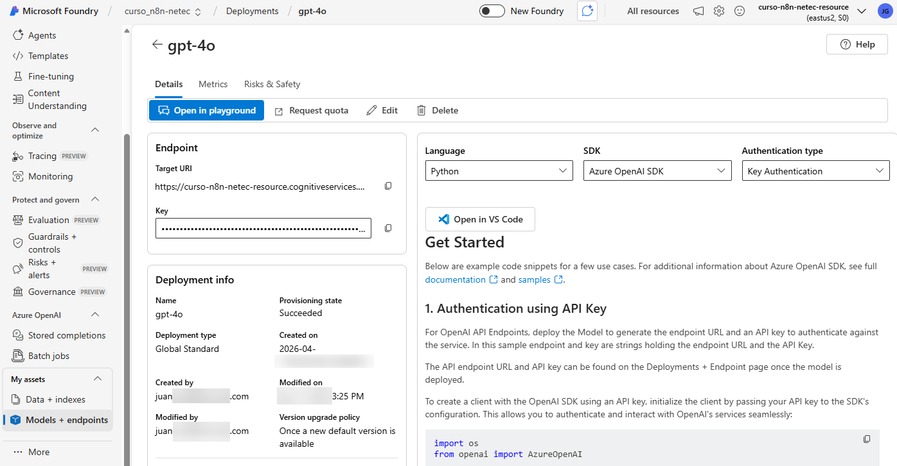

Paso 7. En una nueva pestaña del navegador, ingresa a ```https://aws.amazon.com/bedrock/``` y haz clic en iniciar sesión en la consola. Usa las credenciales proporcionadas por tu instructor.

Paso 8. En el buscador de servicios de AWS, busca y selecciona ```Amazon Bedrock```.

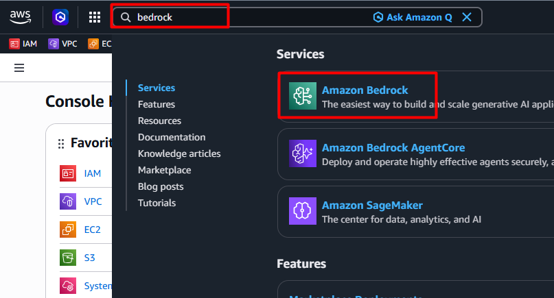

Paso 9. En el panel de la izquierda haz clic en **Model catalog** y en la barra de búsqueda consulta y selecciona ```Claude 3 Haiku```.

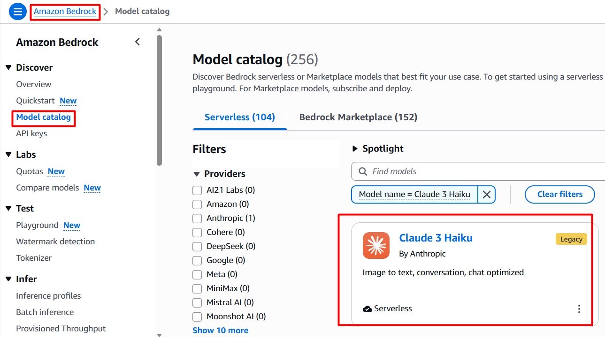

>📌 **Nota**:
>Claude 3 Haiku pasó a estado Legacy, Anthropic inició el proceso de descontinuación de este modelo. Una vez que el modelo entre en el estado Legacy, no se otorgarán aumentos adicionales de cuota de servicio para el modelo. Claude 3 Haiku permanecerá en el estado Legacy hasta el **10 de junio de 2026**, cuando el modelo pasará al estado Extended Access. El **10 de septiembre de 2026**, el modelo llegará al final de su ciclo de vida y ya no estará disponible en Amazon Bedrock. Para efectos de este laboratorio lo usaremos por compatilibidad en n8n. 

Paso 10. Conserva la ventana actual del navegador. 

---

### Tarea 6. Integrar los modelos de gpt-4o y Claude Sonnet de Azure Foundry y Amazon Bedrock en el flujo de N8N. 

Paso 1. Regresa a n8n y haz clic en el **+** después del nodo **Set**. Busca y selecciona **HTTP Request** para usarlo como Azure Foundry.

Paso 2. Configura el nodo de la siguiente manera:

* **HTTP Method:** POST
* **URL:** Copia y pega el endpoint de tu deployment de Azure Foundry (lo puedes encontrar en la ventana que conservaste abierta en el paso 6 de la tarea anterior).
* **Send Headers:** ON
* **Headers:**
    * **Key:** ```Content-Type```
    * **Value:** ```application/json```
* **+ Add Header**
    * **Key:** ```api-key```
    * **Value:** tu API Key de Azure Foundry (la puedes encontrar en la ventana que conservaste abierta en el paso 6 de la tarea anterior).
* **Send Body:** ON
* **Body Content Type:** JSON
* **Specify Fields Bellow:** Using JSON
* **JSON:** 
```json
{
  "messages": [
    {
      "role": "system",
      "content": "Eres un analista de riesgo crediticio"
    },
    {
      "role": "user",
      "content": "Analiza un cliente con score {{$json.score}}, riesgo {{$json.risk_level}} y decisión {{$json.decision}}. Explica en un párrafo si la decisión es correcta."
    }
  ],
  "max_tokens": 200
}
```
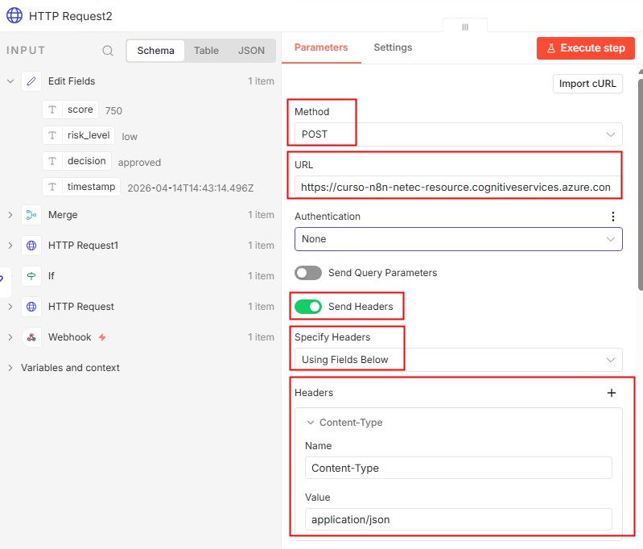
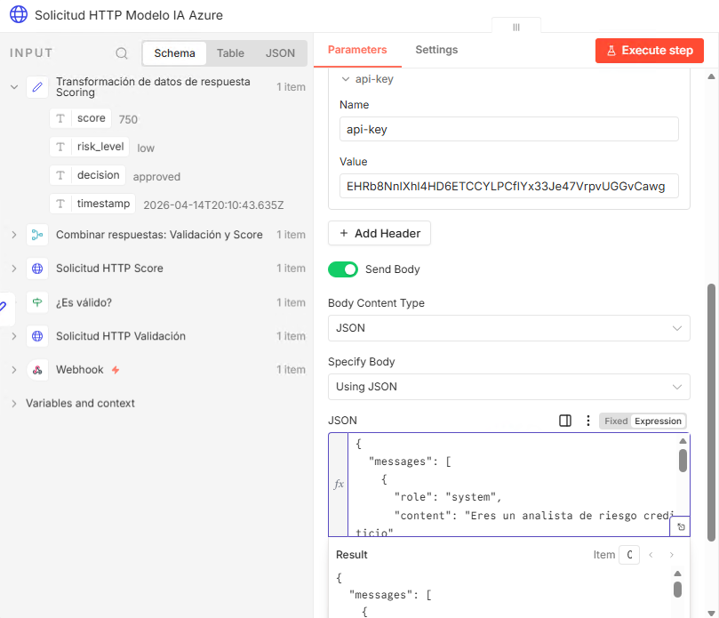

Paso 3. Regresa a la ventana del navegador donde está abierta la consola de AWS. Actualmente estás en Bedrock, del lado izquierdo selecciona API keys. Selecciona la pestaña Long-term API keys y valida que tengas una API key creada y activa.

>📌 **Nota**:
>Previamente, Netec generó una API key para que la uses.

Paso 4. Selecciona el check a la izquierda de la API key, haz clic en el botón **Actions** y selecciona **Manage in IAM Console**.

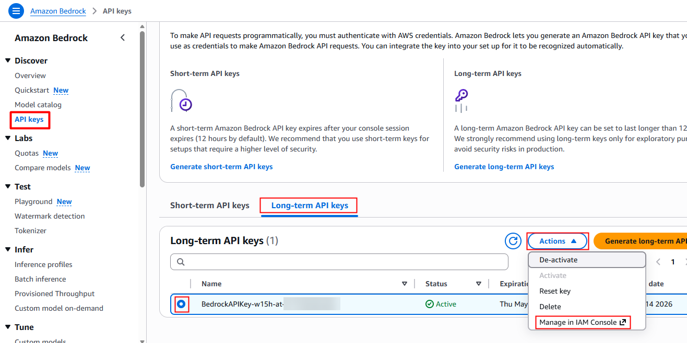

Paso 5. En la nueva ventana que se abrió estás en el usuario creado para identificar la aplicación que consumirá el modelo, con la pestaña **Security credentials**. Baja y verifica que tengas un Access keys y una API key. 

>📌 **IMPORTANTE: En el Escritorio de tu máquina virtual hay un archivo con la Access Key ID, Secret Access Key y API Key. Estas las usarás más adelante en el ejercicio.**

Paso 6. Regresa a n8n. En el lienzo principal, nuevamente desde el nodo **Set**, agrega un nodo de tipo ```AWS Bedrock Chat Model```.

Paso 7. Configura el nodo de la siguiente manera:
* **Credential** AWS (IAM) account
* **AWS (IAM):** Set up credencial
    * **Región:** US East (N. Virginia) - us-east-1
    * **Access Key ID:** Búscala en el archivo del escritorio mencionado anteriormente. 
    * **Secret Access key:** Búscala en el archivo del escritorio mencionado anteriormente. 
    * Haz clic en el botón **Save** y verifica que tengas un mensaje en color verde como: <span style="color:green">Connection tested successfully</span>. Finalmente, cierra la ventana de configuración de las credenciales para continuar con la configuración del nodo. 

    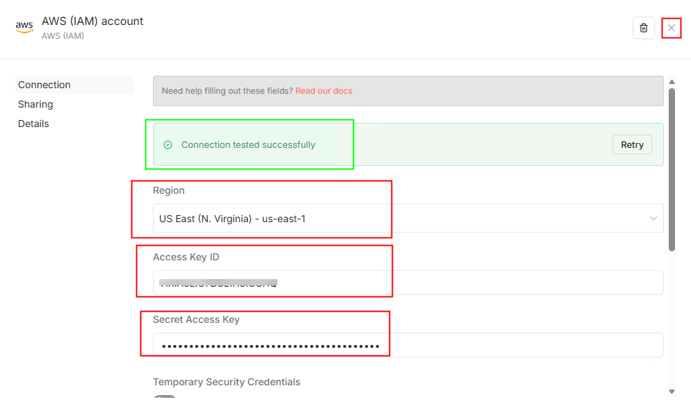

* **Model Source:** On-Demand Models
* **Model:** Claude 3 Haiku

Cierra la ventana de la configuración del modelo de Bedrock, verás en el lienzo que se creó un trigger llamado: **When chat message received**. Elimínalo. 

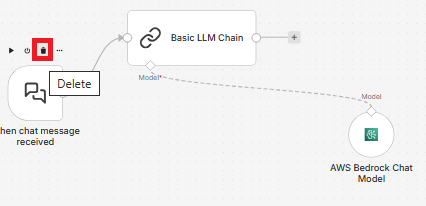

Paso 8. Conecta el nodo **Set** de la transformación de datos del Scoring al nuevo nodo creado llamado: **Basic LLM Chain**.

Paso 9. Abre el nodo **Basic LLM Chain** y configuralo de la siguiente manera:

* **Source for Prompt (User Message):** Define below
* **Prompt (User Message)**: ```Dado un cliente con score {{$json.score}}, riesgo {{$json.risk_level}} y decisión {{$json.decision}}, recomienda los siguientes pasos a seguir.```
* **+ Add Prompt**
    * **Prompt 1:**
        * **Type Name or ID:** System
        * **Message:**  ```Eres un asistente de recomendación financiera.```

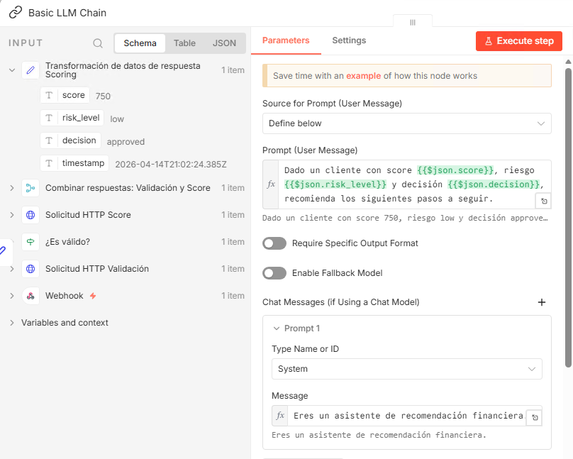

Paso 10. De ser necesario conecta nuevamente el nodo **Set** con el nodo **HTTP Request** que creaste para la conexión con Azure Foundry.

> 🎯**DESAFÍO:** Ahora con tantos nodos es difícil identificarlos, modifica sus nombres para que los reconozcas fácilmente. 

> 💡**PISTA:** En el siguiente paso tienes una idea de cómo debería quedar.

Paso 11. Tu flujo ahora debería verse algo así:

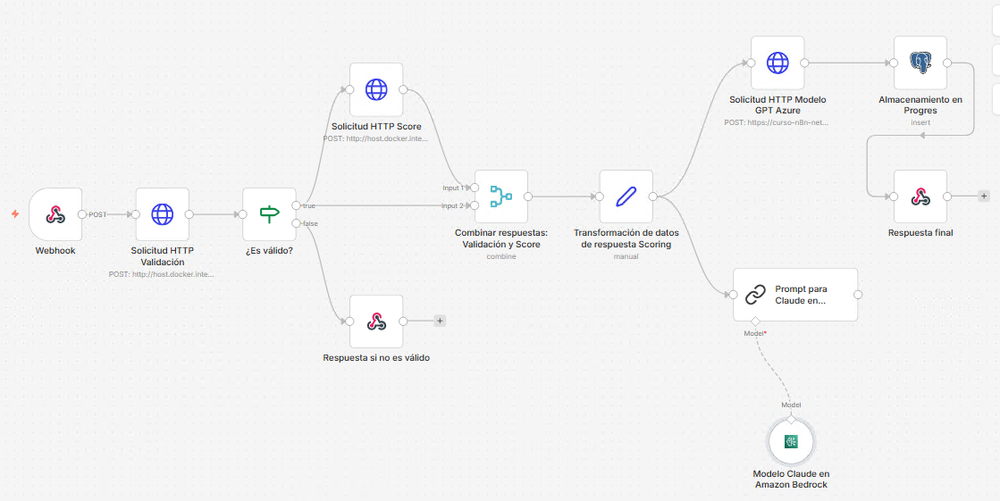

Paso 12. Frente al nodo de solicitud al modelo de Azure Foundry agrega un nodo **Merge** y configuralo de esta manera:

* **Mode:** Combine.
* **Combine By:** Position
* **Number of Inputs:** 2


Paso 13. Regresa al lienzo y elimina la conexión entre el nodo **Merge** y el nodo **Postgres**.

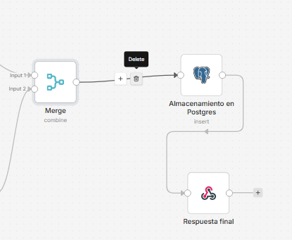

Paso 14. También elimina la conexión entre el nodo **Postgres** y el nodo **Respond to webhook** de la respuesta final.

Paso 15. Conecta el nodo del **Chat Prompt de AWS** al Input 2 del nodo Merge.

Paso 16. Crea un nodo **Set** después del nuevo Merge y configuralo de la siguiente manera:

* **Add Field**
* **name:** ```analysis (Azure)```
* **value:** 
```javascript
{{$json["choices"][0]["message"]["content"]}}
```
* **Add Field**
* **name:** ```recommendation (Bedrock)```
* **value:** 
```javascript
{{$json["text"]}}
```

Paso 17. Regresa al lienzo y fíjate que en este momento deberían estar solos esos nodos: **Postgres** y **Respond to Webhook**.

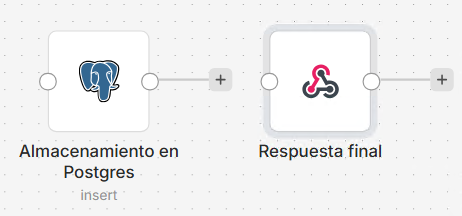

Paso 18. Conecta el nodo **Set** que acabas de crear con el nodo **Respond to Webhook** de la respuesta final.

Paso 15. Conecta el nodo **Postgres** justo después del nodo **Set** de transformación de datos del Scoring.

Ajustando los nombres de los nodos que acabamos de crear, ahora tu flujo debería tener este aspecto:


Paso 16. Ingresa nuevamente al nodo **Respond to Webhook** de la respuesta final y modifica el **Response Body** con lo siguiente:

```json
{{$json}}
```

Paso 17.Finalmente, ajusta el código de la aplicación flask agregando lo siguiente al html de la respuesta:

```html
# 4. Mostrar resultado en HTML (Ajustado para el resultado final)
return f"""
<html>
<head>
    <title>Resultado del crédito</title>
</head>
<body style="font-family: Arial; text-align: center; margin-top: 50px; padding: 20px;">
    
    <h2>Resultado del crédito</h2>
    
    <div style="text-align: left; max-width: 800px; margin: 0 auto; border: 1px solid #ddd; padding: 20px; border-radius: 8px;">
        <p><b>Análisis:</b><br>{(result.get('analysis (Azure)') or 'No disponible').replace('\n', '<br>')}</p>

        <hr>

        <p><b>Recomendación:</b><br>{(result.get('recommendation (Bedrock)') or 'No disponible').replace('\n', '<br>')}</p>
    </div>

    <br><br>

    <a href="/" style="
        padding: 12px 20px;
        background-color: #28a745;
        color: white;
        text-decoration: none;
        border-radius: 5px;
        font-weight: bold;
    ">
        Nueva solicitud
    </a>

</body>
</html>
"""
```

### Resultado esperado

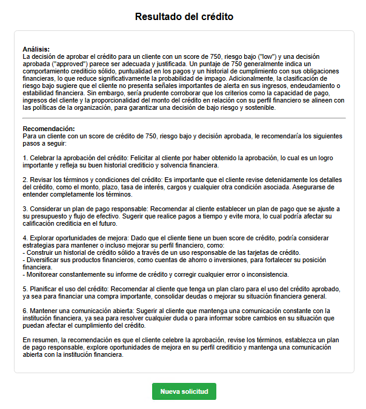
